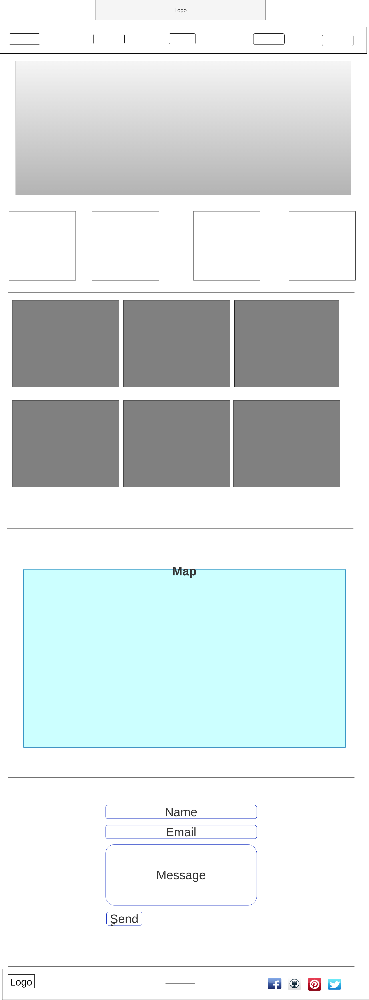
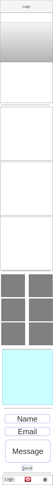
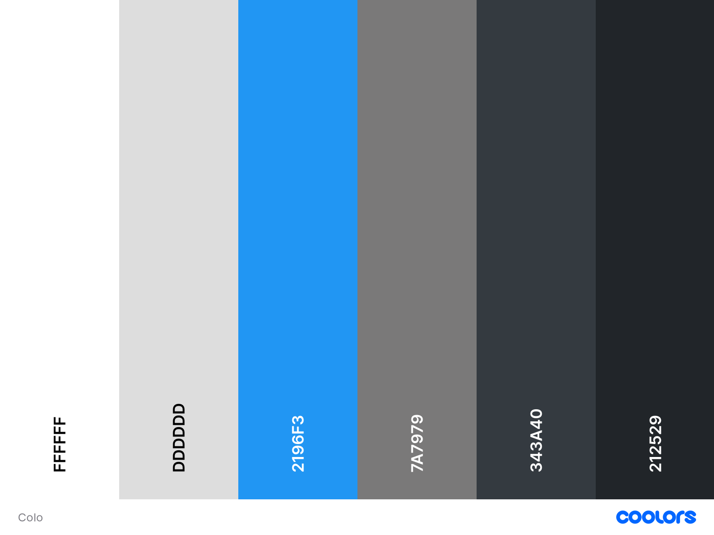

# Portfolio-Project

This repo is for my Portfolio Project

 

Meine Aufgabe war es, eine Webseite mit meinem Portfolio zu erstellen. 
Mein Ablauf war: 
#####	Wireframes für Handy und PC erstellt :

* Large screen Wireframes

     
---

* Small Screen Wireframes

    

---
#####	Die benutzten Farben gesucht und festgelegt

---

-	Coding erstellt 
Begründung Design:
Es war mir wichtig, dass die Seite für den Nutzer übersichtlich ist und leicht zu benutzen. Das Design sollte nicht von den wesentlichen Informationen ablenken. 
Dementsprechend habe ich das Design ausgesucht und nach meinen persönlichen Vorlieben gestaltet.
Gut gelungen:
-	Verlinkung und Hover
Schwierigkeiten:
-	Erstellung der Form
-	Farbe Hover
Erweiterungsmöglichkeiten:
-	Anbieten von fertigen Angeboten mit Preisen